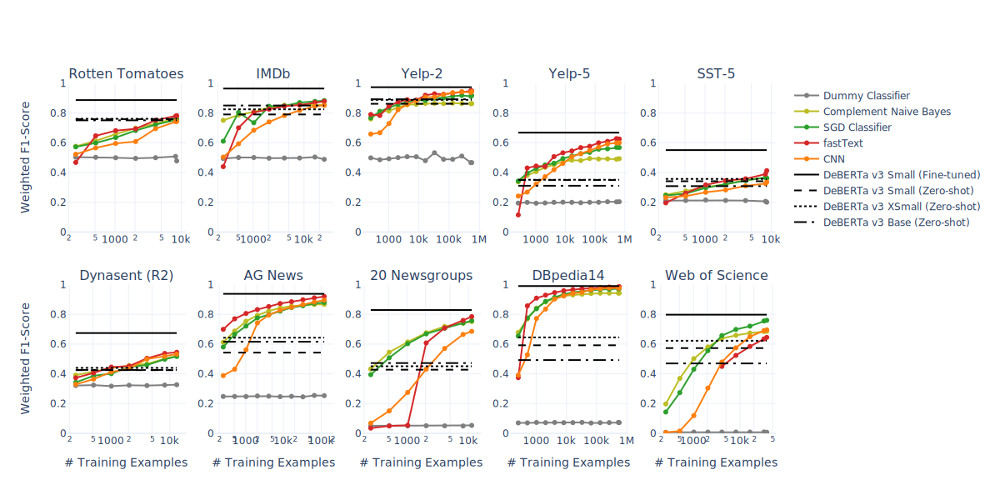
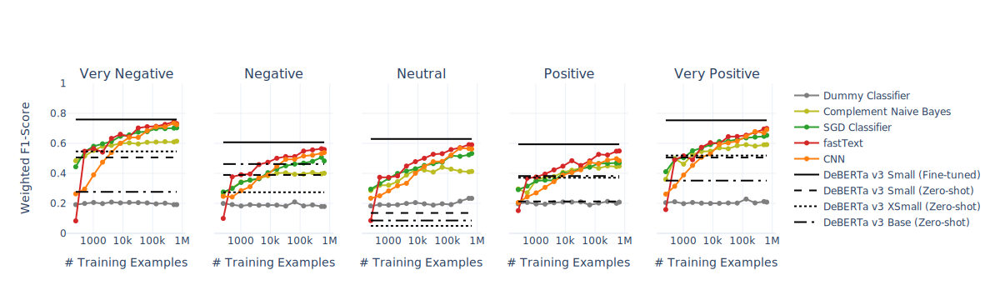
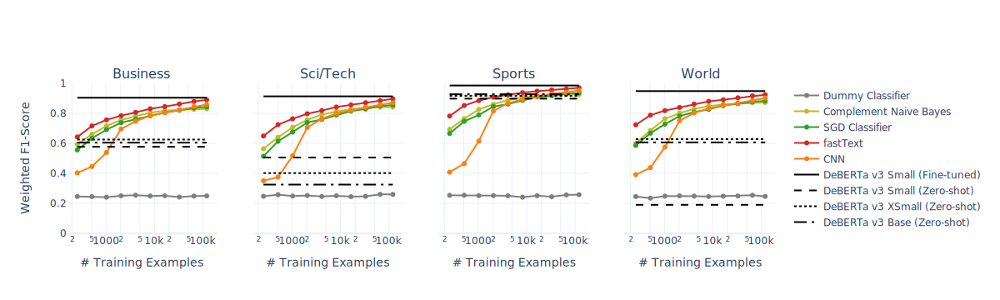
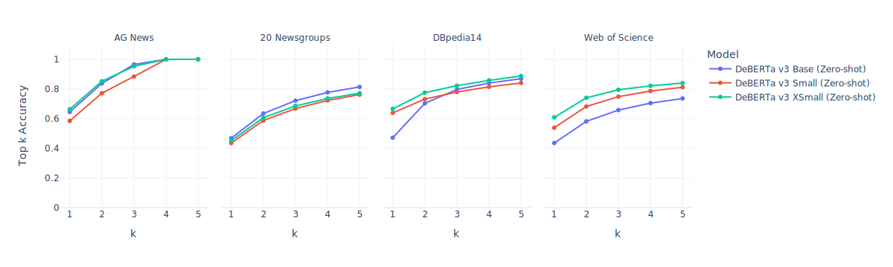
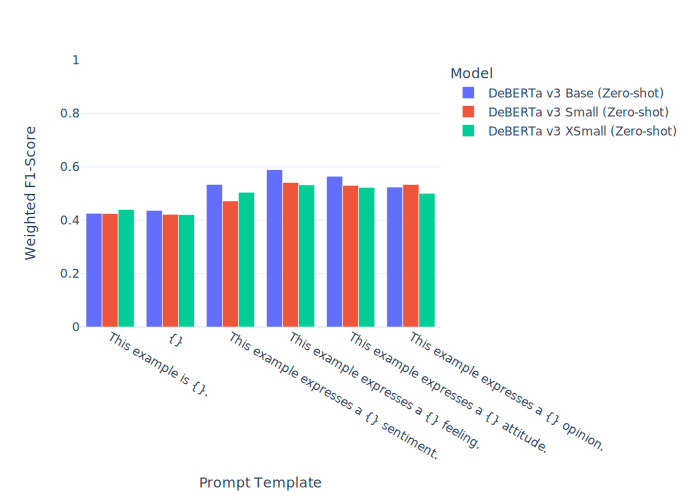

# An In-depth Evaluation of Approaches to Text Classification (IDEATC)
Codebase for a project on evaluating supervised and zero-shot approaches to text classification.

## Getting Started

To reproduce the environment, install packages from a YAML file using `conda`.

```bash
conda env create --file environment.yaml
```

## Structure

- `figures/` - output figures.
- `notebooks/` - notebooks to collect the data and run experiments.
  - `i-data-preparation.ipynb` - collect data for the project.
  - `ii-classic-supervised-baselines.ipynb` - establish baselines using "classic" supervised learning approaches to text classification, including Naive Bayes, Logistic Regression and Support Vector Machines.
  - `iii-neural-supervised-baselines.ipynb` - establish baselines using neural supervised learning approaches to text classification, including fastText, Convolutional Neural Network (CNN) and DeBERTa Transformer.
  - `iv-zero-shot-experiments.ipynb` - experiment with DeBERTa for zero-shot classification.
  - `v-reporting-results.ipynb` - create output tables and figures for the paper.
- `src/` - codebase for conducting experiments using different frameworks.

### Datasets

| #  | Name            | Task                 | Train/Validation/Test Examples | Test Set <br/>Undersampling[^1] | Target Cardinality | Source                                                                                                           |
|----|-----------------|----------------------|--------------------------------|---------------------------------|--------------------|------------------------------------------------------------------------------------------------------------------|
| 1  | Rotten Tomatoes | Sentiment Analysis   | 8530 / 1066 / 1066             | No                              | 2                  | [HuggingFace Datasets](https://huggingface.co/datasets/rotten_tomatoes)                                          |
| 2  | IMDb            | Sentiment Analysis   | 25,000 / 0 / 25,000            | Yes                             | 2                  | [HuggingFace Datasets](https://huggingface.co/datasets/imdb)                                                     |
| 3  | Yelp-2          | Sentiment Analysis   | 560,000 / 0 / 38,000           | Yes                             | 2                  | [HuggingFace Datasets](https://huggingface.co/datasets/yelp_polarity)                                            |
| 4  | Yelp-5          | Sentiment Analysis   | 650,000 / 0 / 50,000           | Yes                             | 5                  | [HuggingFace Datasets](https://huggingface.co/datasets/yelp_review_full)                                         |
| 5  | SST-5           | Sentiment Analysis   | 8544 / 1101 / 2210             | No                              | 5                  | [HuggingFace Datasets](https://huggingface.co/datasets/SetFit/sst5)                                              |
| 6  | dynasent        | Sentiment Analysis   | 13,065 / 720 / 720             | No                              | 3                  | [HuggingFace Datasets](https://huggingface.co/datasets/dynabench/dynasent)                                       |
| 7  | AG News         | News Categorisation  | 120,000 / 0 / 7,600            | No                              | 4                  | [HuggingFace Datasets](https://huggingface.co/datasets/ag_news)                                                  |
| 8  | 20 Newsgroups   | News Categorisation  | 11,314 / 0 / 7,532             | No                              | 20                 | [Scikit-learn Datasets](https://scikit-learn.org/stable/datasets/real_world.html#the-20-newsgroups-text-dataset) |
| 9  | DBpedia14       | Topic Classification | 560,000 / 0 / 70,000           | Yes                             | 14                 | [HuggingFace Datasets](https://huggingface.co/datasets/dbpedia_14)                                               |
| 10 | Web of Science  | Topic Classification | 46,985 / 0 / 0[^2]             | No                              | 134                | [Mendeley Data](https://data.mendeley.com/datasets/9rw3vkcfy4/6)                                                 |

[^1]: For datasets with a large number of test examples, the test set was undersampled to keep only 500 examples per class.

[^2]: For Web of Science, the test set of created by randomly sampling 20% of the examples from the test set.

## Selected Figures

The figures below report the performance on the test set.

### Figure 1. Learning Curves for Supervised and Zero-shot Models for 10 Datasets



### Figure 2. Learning Curves per Class for Yelp-5 Dataset



### Figure 3. Learning Curves per Class for AG News Dataset



### Figure 4. Top k Accuracy of ZSC DeBERTa Models on 4 Datasets



### Figure 5. Prompting Experiment on Dynasent (R2)

